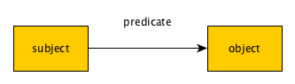

# Smart Containers

[](https://gitter.im/charlesvardeman/sc_spec)

## Table of contents

 1. [Quick intro](#quick-intro)
 2. [Brief example of Smart Containers in action](#brief-example-of-smart-containers-in-action)
 3. [Docker](#docker)
 4. [RDF](#rdf)
 5. [Ontologies](#ontologies)
 6. [Persistent Identifiers and minting URIs](#persistent-identifiers-and-minting-uris)

Specification for Smart Containers

## Quick Intro
Scientists need an efficient approach to preserve and share the results of computational work and in fact, is required by reproducibility requirements of the scientific process. Although a variety of technologies have been created to capture computational experiments, it is still a struggle for scientists to understand the preserved experiment without a detailed documentation and context of the results being shared. Smart Container (SC) is a modular specification and implementation that leverages linked data principles to enable the preservation, sharing and reuse of both software and data artifacts.

Smart Containers begin with conceptualizing computational experiments from the perspective of computational environments and activities within those environments as provided by the Docker Linux container framework. Docker is a lightweight virtualization platform that has several properties such as versioning of file system operations, a modular design for distribution of software components as well as a sustainable community that make it attractive as a preservation tool. One community of collaborators at CERN is already exploring Docker to preserve high energy physics experiments. Our approach is to eventually provide a mechanism that captures the additional provenance of computational experiments in a machine readable approach using the W3C standard RDF data model that has been shown to aid in contextualization of scientific experiment.

By starting with a formal model of Docker and the provenance of Docker activities, we hope to provide a basis for 1) existing scientific workflow frameworks and their workflow descriptions to be captured within a Linux container environment 2) data to be integrated in a consistent manner and lastly 3) for a common description of the environment. The ultimate goal being to provide automated tools that “wrap” the existing Docker command line tool and infrastructure such that it is transparent to the scientist but captures information necessary to populate the metadata behind the scenes. Automated scientific gateways that utilize Docker as a deployment and execution platform would provide a further degree of transparency and allow researchers a low barrier for utilization.

Features:


## Brief Example of Smart Containers in action


## Docker
[Docker](https://www.docker.com/) is an application that encapsulates and extends a Linux Kernel feature known as Linux Containers (LXC). It isolates an application with its dependencies in a single process which is more light-weighted than full hypervisor virtualization of guest OS. It can be provisioned by a simple Dockerfile text based workflow. Docker also adopted a layer file system way to achieve versioning and component re-use. A Docker image is a read-only layer which is stateless. A container has states: when it is running, it represents a tree of processes isolated from other processes on the host; when it exits, it represents a read-write layer generated by the process along with its all underneath stateless images. Docker provides the ability for the Docker community to share images through the [Docker Hub](https://hub.docker.com/) providing a degree of software and infrastructure reuse.

### General Docker Concepts
[The Docker User Guide](http://docs.docker.com/engine/userguide/) is a good resource for understanding how Docker works in action. Docker has created a distribution system for Docker Containers (LXC containers) that uses *Images* as the distribution mechanism. 
> "An Image is an ordered collection of root filesystem changes and the corresponding execution parameters for use within a container runtime. This specification outlines the format of these filesystem changes and corresponding parameters and describes how to create and use them for use with a container runtime and execution tool."

Docker composes images [(specification)](https://github.com/docker/docker/blob/master/image/spec/v1.md) out of file system layers, each of which represents a change to a base image. As a result, share images layers with many other repositories in the "Docker Hub". 
 > " **ImageID**
> Each layer is given an ID upon its creation. It is represented as a hexadecimal encoding of 256 bits, e.g., a9561eb1b190625c9adb5a9513e72c4dedafc1cb2d4c5236c9a6957ec7dfd5a9. Image IDs should be sufficiently random so as to be globally unique. 32 bytes read from /dev/urandom is sufficient for all practical purposes. Alternatively, an image ID may be derived as a cryptographic hash of image contents as the result is considered indistinguishable from random. The choice is left up to implementors."

Additional terminology from the Docker Specification.
> "**Image Parent**
Most layer metadata structs contain a parent field which refers to the Image from which another directly descends. An image contains a separate JSON metadata file and set of changes relative to the filesystem of its parent image. Image Ancestor and Image Descendant are also common terms."

> "**Image Checksum**
Layer metadata structs contain a cryptographic hash of the contents of the layer's filesystem changeset. Though the set of changes exists as a simple Tar archive, two archives with identical filenames and content will have different SHA digests if the last-access or last-modified times of any entries differ. For this reason, image checksums are generated using the TarSum algorithm which produces a cryptographic hash of file contents and selected headers only. Details of this algorithm are described in the separate TarSum specification."

> "**Tag**
A tag serves to map a descriptive, user-given name to any single image ID. An image name suffix (the name component after :) is often referred to as a tag as well, though it strictly refers to the full name of an image. Acceptable values for a tag suffix are implementation specific, but they SHOULD be limited to the set of alphanumeric characters [a-zA-z0-9], punctuation characters [._-], and MUST NOT contain a : character."

When a Docker Image is instantiated as a Container in a file system using an "Image Filesystem Changeset". From the specification:
> "An image root filesystem is first created as an empty directory named with the ID of the image being created. Here is the initial empty directory structure for the changeset for an image with ID c3167915dc9d (real IDs are much longer, but this example use a truncated one here for brevity. Implementations need not name the rootfs directory in this way but it may be convenient for keeping record of a large number of image layers.)..."

Files and directories are then created and directory is then committed as a plain Tar archive.

> "The TarSum checksum for the archive file is then computed and placed in the JSON metadata along with the execution parameters. To make changes to the filesystem of this container image, create a new directory named with a new ID, such as f60c56784b83, and initialize it with a snapshot of the parent image's root filesystem, so that the directory is identical to that of c3167915dc9d. NOTE: a copy-on-write or union filesystem can make this very efficient:"

The **CONTAINER ID**, a unique identifier you can use to refer to the container in other commands (this is kind of like a process id in Linux) but only persists while the container is active.

### Client-Server Architecture
Docker uses a client-server architecture so that local command line utilities can manage remote docker instances. From the [introduction](http://docs.docker.com/engine/introduction/understanding-docker/):
> "Docker uses a client-server architecture. The Docker client talks to the Docker daemon, which does the heavy lifting of building, running, and distributing your Docker containers. Both the Docker client and the daemon can run on the same system, or you can connect a Docker client to a remote Docker daemon. The Docker client and daemon communicate via sockets or through a RESTful API."

### Existing Metadata in Docker
Docker includes metadata attached to images and containers and may be accessed through the Docker [inspect](https://docs.docker.com/reference/commandline/inspect/) command. Docker inspect returns a JSON array.  

```bash
docker inspect [OPTIONS] CONTAINER|IMAGE [CONTAINER|IMAGE...]

```

Individual fields of the JSON key-value structure may also be searched. For example.
```bash
$ docker inspect --format='{{.NetworkSettings.IPAddress}}' $INSTANCE_ID
```

Metadata is stored by Docker in the */var/lib/docker* directory on the host machine. The exact directory depends on the storage driver.
You can manually set the storage driver with the -s or --storage-driver= option to the Docker daemon.

`/var/lib/docker/{driver-name}` will contain the driver specific storage for contents of the images.
`/var/lib/docker/graph/<id>` now only contains metadata about the image, in the json and layersize files.
In the case of aufs:

`/var/lib/docker/aufs/diff/<id>` has the file contents of the images.
`/var/lib/docker/repositories-aufs` is a JSON file containing local image information. This can be viewed with the command docker images.
In the case of devicemapper:

`/var/lib/docker/devicemapper/devicemapper/data` stores the images
`/var/lib/docker/devicemapper/devicemapper/metadata` the metadata
Note these files are thin provisioned "sparse" files so aren't as big as they seem.

Docker's behavior and output formats may also be modified through the [*config.json*](https://docs.docker.com/reference/commandline/cli/) file that specifies default behavior of the command line as well as formatting options for command results.

Metadata is set through the Docker [label](https://docs.docker.com/userguide/labels-custom-metadata/) *command line option to other commands* that provides a `<key>/<value>` pair. Unfortunately, Docker doesn't provide a direct means of modifying or adding labels to containers or images other than using the run command. For example


```bash
LABEL com.example.image-specs="{\"Description\":\"A containerized foobar\",\"Usage\":\"docker run --rm example\\/foobar [args]\",\"License\":\"GPL\",\"Version\":\"0.0.1-beta\",\"aBoolean\":true,\"aNumber\":0.01234,\"aNestedArray\":[\"a\",\"b\",\"c\"]}"
```

Docker labels may also be specified as a command field in a **Dockerfile** which will be instantiated during the docker [build](https://docs.docker.com/reference/builder/) command. For example:
```
LABEL com.example.label-with-value="foo"
LABEL version="1.0"
LABEL description="This text illustrates \
that label-values can span multiple lines."
```

Docker provides some brief guidelines for constructing labels taken from their documentation as follows:
> To prevent naming conflicts, Docker namespaces label keys using a reverse domain notation. Use the following guidelines to name your keys:

> + All (third-party) tools should prefix their keys with the reverse DNS notation of a domain controlled by the author. For example, com.example.some-label.
> + The com.docker.*, io.docker.* and org.dockerproject.* namespaces are reserved for Docker’s internal use.
> + Keys should only consist of lower-cased alphanumeric characters, dots and dashes (for example, [a-z0-9-.])
> + Keys should start and end with an alpha numeric character
> + Keys may not contain consecutive dots or dashes.
> + Keys without namespace (dots) are reserved for CLI use. This allows end- users to add metadata to their containers and images without having to type cumbersome namespaces on the command-line.

Smart Containers relies on this ability to attach metadata to a container or image. Since a label may be an JSON array, Smart Containers attaches a **JSON-LD** serialization of the graph object to the Docker container. All of the previous provenance history of a Docker Object (image/container) is encoded using RDF/OWL based vocabularies.

### Issues in Docker
* Most Linux distributions are not designed to run inside a Docker Container since they require some sort of init system to provide system level services. Docker generally only runs one process withing a container environment, although it has the capability to run multiple tasks. 
> "When your Docker container starts, only the CMD command is run. The only processes that will be running inside the container is the CMD command, and all processes that it spawns. That's why all kinds of important system services are not run automatically – you have to run them yourself."

The [Phusion](http://phusion.github.io/baseimage-docker/) docker base images are attempting to create a set minimal "init" environment based on Ubuntu such that services (databases, connectors, etc) may be run concurrently instead of using the Docker "link" methodology to provide the service by connecting multiple containers. 

* A second issue is the inability to directly write a label without changing the state of the container or image. Because the label must be specified as part of the run command line or as part of the Dockerfile during a build operation, an additional run command must be executed to "attach" the label metadata from the previous operation. This creates a mismatch between the checksums of objects referred to in the provenance graph and the current container or image object which is always referring to the parent objects checksum, not itself.

## RDF
The Resource Description Framework (RDF) is a framework for representing and linking data within the World Wide Web infrastructure [[RDF1.1](http://www.w3.org/TR/rdf11-concepts/)], and is a graph-based data model, where the core structure of the abstract syntax is a set of triples, each consisting of a subject, a predicate and an object. The idea is that we want relationship identifiers that form a "Knowledge Graph" and represent [things not strings](https://googleblog.blogspot.com/2012/05/introducing-knowledge-graph-things-not.html).



There are several serialization syntaxes for storing and exchanging RDF such as [Turtle](http://www.w3.org/TR/turtle/) and [JSON-LD](http://www.w3.org/TR/json-ld/). When creating new RDF resources, Turtle is regarded as a more human *readable* serialization although JSON-LD has the advantage of being JSON compliant. Servers should implement content negotiation in order to handle different serialization formats. Additionally, the W3C has created an extension of Turtle for publication of RDF datasets called [Trig](http://www.w3.org/TR/trig/) such that there is support for representing a complete RDF Dataset that may contain multiple graphs. Because JSON-LD supports the `@Graph` construct, RDF serialized in Trig *should* be also able to be serialized in JSON-LD but may not be as "human readable".


## Linked Data Principles
Tim Berners-Lee published a [technical note](http://www.w3.org/DesignIssues/LinkedData.html) outlining some basic principles for publishing data on the Web. These principles can be summarized as:

1. Use URIs as names for things.
2. Use HTTP URIs so that people can look up those names.
3. When someone looks up a URI, provide useful information, using the standards (RDF*, SPARQL)
4. Include links to other URIs. so that they can discover more things.

Data that adopts some of these principles is referred to as *"Five Star"* linked data. The [W3C](http://www.w3.org/standards/semanticweb/data) continues to create [recommendations](http://www.w3.org/standards/techs/linkeddata#w3c_all) to facilitate the linked data vision. The [BBC](http://www.bbc.co.uk/blogs/radiolabs/s5/linked-data/s5.html) has a nice introduction to linked data principles.
## Ontologies
To facilitate the capturing of *concepts* within RDF data, the W3C has created a specification called the Web Ontology Language (OWL). OWL is on it's second revision and a [primer](http://www.w3.org/TR/owl2-primer/) for OWL 2 is available as a W3C technical report. From this technical report:
> "The W3C OWL 2 Web Ontology Language (OWL) is a Semantic Web language designed to represent rich and complex knowledge about things, groups of things, and relations between things. OWL is a computational logic-based language such that knowledge expressed in OWL can be reasoned with by computer programs either to verify the consistency of that knowledge or to make implicit knowledge explicit. OWL documents, known as ontologies, can be published in the World Wide Web and may refer to or be referred from other OWL ontologies. OWL is part of the W3C's [Semantic Web](http://www.w3.org/2001/sw/) technology stack, which includes RDF [[RDF Concepts]](http://www.w3.org/TR/owl2-primer/#ref-rdf-concepts) and SPARQL [[SPARQL]](http://www.w3.org/TR/owl2-primer/#ref-sparql)."

## Existing Ontologies Leveraged for Smart Containers.
### W3C Provenance Vocabulary
The W3C has created a specification for the exchange of provenance data on the World Wide Web. It has also created an [implementation](http://www.w3.org/TR/2012/CR-prov-o-20121211/) of this specification using OWL 2. From the [Prov Primer](http://www.w3.org/TR/prov-primer/):
> "The provenance of digital objects represents their origins. PROV is a specification to express provenance records, which contain descriptions of the entities and activities involved in producing and delivering or otherwise influencing a given object. Provenance can be used for many purposes, such as understanding how data was collected so it can be meaningfully used, determining ownership and rights over an object, making judgements about information to determine whether to trust it, verifying that the process and steps used to obtain a result complies with given requirements, and reproducing how something was generated."

#### Prov snippit in JSON-LD
An example of Prov in a JSON-LD serialization from the [Kleio](https://github.com/tetherless-world/kleio/tree/master/examples/jsonld-example) github repository. Kleio provides a python implementation of Prov using [Rdflib](https://github.com/RDFLib/rdflib).
```json
{
  "@context": {
    "foaf": "http://xmlns.com/foaf/0.1/",
    "prov": "http://www.w3.org/ns/prov#",
    "rdf": "http://www.w3.org/1999/02/22-rdf-syntax-ns#",
    "rdfs": "http://www.w3.org/2000/01/rdf-schema#",
    "test": "http://tw.rpi.edu/ns/test#",
    "xsd": "http://www.w3.org/2001/XMLSchema#"
  },
  "@graph": [
    {
      "@graph": [
        {
          "@id": "test:bob",
          "@type": "prov:Person",
          "foaf:name": "Bob",
          "prov:influenced": [
            {
              "@id": "test:entity"
            },
            {
              "@id": "test:activity"
            }
          ]
        },
        {
          "@id": "test:entity",
          "@type": "prov:Entity",
          "prov:wasAttributedTo": {
            "@id": "test:bob"
          },
          "prov:wasGeneratedBy": {
            "@id": "test:activity"
          },
          "prov:wasInfluencedBy": [
            {
              "@id": "test:bob"
            },
            {
              "@id": "test:activity"
            }
          ],
          "rdfs:label": "example entity"
        },
        {
          "@id": "test:activity",
          "@type": "prov:Activity",
          "prov:generated": {
            "@id": "test:entity"
          },
          "prov:influenced": {
            "@id": "test:entity"
          },
          "prov:wasAssociatedWith": {
            "@id": "test:bob"
          },
          "prov:wasInfluencedBy": {
            "@id": "test:bob"
          },
          "rdfs:label": "example activity"
        }
      ]
    },
    {
      "@graph": [
        {
          "@id": "test:derived_entity",
          "@type": "prov:Entity",
          "prov:wasDerivedFrom": {
            "@id": "test:entity"
          },
          "prov:wasInfluencedBy": {
            "@id": "test:entity"
          },
          "rdfs:label": "derived example entity"
        },
        {
          "@id": "test:entity",
          "@type": "prov:Entity",
          "prov:influenced": {
            "@id": "test:derived_entity"
          }
        }
      ],
      "@id": "urn:x-rdflib:default"
    }
  ]
}
```
### W3C Health Care and Life Sciences Working Group
The W3C Health Care and Life Sciences have released a [technical note](http://www.w3.org/2001/sw/hcls/notes/hcls-rdf-guide/) on best practices for publishing data as **Linked Data** on the World Wide Web. As part of this groups activities, a series of [recommended](http://www.w3.org/TR/2015/NOTE-hcls-dataset-20150514/) vocabularies for publication of datasets has been established. The vocabularies chosen are a well known set including the previously specified prov vocabulary. The dataset note contains a minimum specification of "**MUSTS**" for a dataset publication to be compliant. Smart Containers should enable the publication of datasets and software within the minimum specification for the vocabulary.

### Open Archives Initiative Object Reuse and Exchange (OAI-ORE)
The [OAI-ORE](https://www.openarchives.org/ore/1.0/primer) defines standards for the description and exchange of aggregations of "web resources" for use in archives and repositories. The Open Archives Initiative (OAI) has released a primer on the use of [JSON-LD](https://www.openarchives.org/ore/0.9/jsonld) for the description of these aggregations of web resources. It should be noted, there is significant overlap between the vocabularies specified by the Health Care and Life Sciences group and the OAI group with ORE only differing by the **Addition** of the ORE (http://www.openarchives.org/ore/terms/) and Fabio (http://purl.org/spar/fabio/) namespaces. A JSON-LD ORE example follows:

```JSON
{ "@context": "https://w3id.org/ore/context",
  "@type": "ResourceMap",
  "describes": {
      "@id": "http://example.com/aggregation-1",
      "@type": "Aggregation",
      
      "aggregates": [
          "http://example.com/document-1",
          { "@id": "http://other.example.org/data-2",
            "@type": "AggregatedResource"
          }
      ]
      
  }
}
```
### General Workflow descriptions
Work exists that describe generic scientific workflow processes that can be leveraged for Smart Containers such as the [wfdesc](http://www.sciencedirect.com/science/article/pii/S1570826815000049) vocabulary that uses Prov as a foundational ontology to facilitate interoperability.


### Notes
1) We should follow the ["Five Stars of Linked Data Vocabulary Use"](http://www.semantic-web-journal.net/content/five-stars-linked-data-vocabulary-use) principles.
2) Ontologies should be published as persistent JSON-LD contexts to facilitate extension. 
3) Smart Containers only *Populate* core components of the vocabularies. Most Alignment should happen at the context level.
4) An ontology pattern based approach is will facilitate reuse and interoperability.
5) Links need to be **dereferencable** to facilitate HATEOS, RESTFul and contextualiztion of resources. The ["Follow your nose principle"](http://patterns.dataincubator.org/book/follow-your-nose.html) is important.

### Ontology Design Patterns created for Smart Containers
 

## Persistent Identifiers and minting URIs

### Cool URIs for the Semantic Web
RDF uses URIs to describe both web resources (documents) and concepts that represent real wold things. From the [interest group note](http://www.w3.org/TR/cooluris/)
>"The Resource Description Framework RDF allows users to describe both Web documents and concepts from the real world—people, organisations, topics, things—in a computer-processable way. Publishing such descriptions on the Web creates the Semantic Web. URIs (Uniform Resource Identifiers) are very important, providing both the core of the framework itself and the link between RDF and the Web. This document presents guidelines for their effective use. It discusses two strategies, called 303 URIs and hash URIs. It gives pointers to several Web sites that use these solutions, and briefly discusses why several other proposals have problems."

Because on the Semantic Web, URIs identify not just web documents but also real world objects, we need a consistent way of distinguishing between referencing a web document about a thing or the thing itself that is outside of the Web. One suggested solution is the use of "hash URIs" for **non-document** resources since URIs are permitted to contain fragments that are separated from the rest of the URI by the hash (#) symbol. The examples given in the technical report are illustrative:

> If Example Inc. adopts this solution, then they could use these URIs to represent the company, Alice, and Bob:
>
> `http://www.example.com/about#exampleinc`
> Example Inc., the company
> `**http://www.example.com/about#bob**`
> Bob, the person
> `http://www.example.com/about#alice`
> Alice, the person
> Clients will always strip off the fragment part before requesting any of these URIs, resulting in a request to this URI:
>
> `http://www.example.com/about`
> RDF document describing Example Inc., Bob, and Alice
> At this URI, Example Inc. could serve an RDF document that contains descriptions of all three resources, using the original hash URIs to identify the resources.

> Alternatively, content negotiation (see Section 2.1.) could be employed to redirect from the about URI to either a HTML or an RDF representation. The decision which to return is based on client preferences and server configuration, as explained below in Section 4.7. The Content-Location header should be set to indicate if the hash URI refers to a part of the HTML document or RDF document.

### Trusty URIs
Cool URIs assume that the resource is dereferencable which may not be true of digital artifacts that are not web resources. To account for this issue the idea if [Trusty URIs](http://trustyuri.net/) and a [publication](http://arxiv.org/abs/1401.5775) has been developed and applied with respect to [**Nanopublications**](http://arxiv.org/abs/1508.04977) which are an emerging methodology for scientific publishing that use Semantic Web methodology to link both provenance and metadata information together. An example of such a Data Set is the "Linked Drug-Drug Interactions"(LIDDI) [dataset](http://arxiv.org/abs/1507.05408). There are frameworks implementing Trusty URIs with different languages in [github](https://github.com/trustyuri). Trusty URIs identifiers contain a cryptographic hash value calculated with respect to the content of the represented digital artifact.

An example of a TrustyURI `http://example.org/np1#RAHGB0WzgQijR88g_rIwtPCmzYgyO4wRMT7M91ouhojsQ`. Since Docker already generates container and image checksums that are verifyable from within Docker, instance URIs should be generated using these checksums. Since the resolver of a docker container or image id resource is **NOT** a HTTP URL, URI's that generated from docker resources should have the following syntax.

```
<urn:docker:container#(container id)>
<urn:docker:image#(image id)>
```

This uses the same concept as a trustyURI, but identifies the correct "resolver" of a given checksum.

There should be a translation feature to identify resources that are **resolvable** once the container is **running** and has a IP address and web services. Resources used in creating a docker image (github software, mounted remote file systems, etc) that are web resolvable should be identified by that URI not the `urn:docker` schema following "cool" URI or Trusty URI principles. 


### Ontology Namespace. 
Previous best practices for naming of namespaces in ontologies was to use a Persistent URL or [PURL](https://purl.oclc.org/docs/index.html) identifier. The rational for this was to create a persistent namespace for reasoners and other processors of RDF data but enable the "follow your nose" principle and create a dereferenceable resource that could be redirected if the web location of the resource changed. While PURL namespaces are currently being maintained and will be for the foreseeable future, no new PURL namespaces may be created. The W3C Permanent Identifier Community Group has created a [URL redirection service](https://w3id.org/) that operates like a "switchboard", connecting requests for information with the true location of information on the Web. Namespaces used by ontologies created by Smart Containers should be w3id.org namespaces to facilitate future interoperability. Because Smart Containers is a preservation mechanism, the ability to have stable namespaces that can be changed without changing each document that uses the implemented ontology. 

### Identifiers for Researchers.
Smart Containers uses [ORCID](http://orcid.org/) as a unique identifier for researchers. ORCID:
>"ORCID provides a persistent digital identifier that distinguishes you from every other researcher and, through integration in key research workflows such as manuscript and grant submission, supports automated linkages between you and your professional activities ensuring that your work is recognized."

ORCID also follows Linked Data Principles since the resource identifier for a research is dereferenceable as linked data. For example the ORCID the identifies the researcher "Charles F. Vardeman II" is 0000-0003-4091-6059. As a URI on the semantic web it is: <http://orcid.org/0000-0003-4091-6059/>. If the URI is defreferenced:

```bash
curl --header "Accept: text/turtle" -L http://orcid.org/0000-0003-4091-6059
```

The following response is returned:
```turtle
@prefix pav:     <http://purl.org/pav/> .
@prefix owl:     <http://www.w3.org/2002/07/owl#> .
@prefix rdf:     <http://www.w3.org/1999/02/22-rdf-syntax-ns#> .
@prefix gn:      <http://www.geonames.org/ontology#> .
@prefix xsd:     <http://www.w3.org/2001/XMLSchema#> .
@prefix rdfs:    <http://www.w3.org/2000/01/rdf-schema#> .
@prefix prov:    <http://www.w3.org/ns/prov#> .
@prefix foaf:    <http://xmlns.com/foaf/0.1/> .

<http://sws.geonames.org/6252001/>
      a       rdfs:Resource , <http://schema.org/Place> , gn:Feature , <http://www.w3.org/2003/01/geo/wgs84_pos#SpatialThing> ;
      rdfs:label "United States" ;
      gn:countryCode "US" ;
      gn:name "United States" .

<http://orcid.org/0000-0003-4091-6059/>
      a       foaf:PersonalProfileDocument , foaf:OnlineAccount ;
      rdfs:label "0000-0003-4091-6059" ;
      pav:createdOn "2014-07-15T18:05:52.395Z"^^xsd:dateTime ;
      pav:createdWith
              [ a       prov:Agent
              ] ;
      pav:lastUpdateOn "2015-09-03T12:05:25.669Z"^^xsd:dateTime ;
      prov:generatedAtTime
              "2015-09-03T12:05:25.669Z"^^xsd:dateTime ;
      foaf:accountName "0000-0003-4091-6059" ;
      foaf:accountServiceHomepage
              <http://orcid.org> ;
      foaf:maker <http://orcid.org/0000-0003-4091-6059> ;
      foaf:primaryTopic <http://orcid.org/0000-0003-4091-6059> .

<http://orcid.org/0000-0003-4091-6059>
      a       foaf:Person , prov:Person ;
      rdfs:label "Charles Vardeman II" ;
      foaf:account <http://orcid.org/0000-0003-4091-6059/> ;
      foaf:based_near
              [ a       gn:Feature ;
                gn:countryCode "US" ;
                gn:parentCountry <http://sws.geonames.org/6252001/>
              ] ;
      foaf:familyName "Vardeman II" ;
      foaf:givenName "Charles" ;
      foaf:publications <http://orcid.org/0000-0003-4091-6059/> .
```

Note that both the *Provenance* of the resource <http://orcid.org/0000-0003-4091-6059/> and of the researcher <http://orcid.org/0000-0003-4091-6059> is specified.

### DOI Persistent Identifiers
The [Digital Object Identifier system](https://www.doi.org/) is a non-for-profit organization that provides Digital Object Identifier services and registration. However, even though the DOI resolver returns *web accessable* information, it *does not* return the resource itself, just a representation of the resource. From the [DOI Handbook](https://www.doi.org/doi_handbook/TOC.html):

> "In the case of the DOI® System, using the Handle System® as a reference implementation, the resolution is from a DOI name, e.g., 10.1000/140, to one or more (hence "multiple") pieces of typed data: e.g. URLs representing instances of (manifestations of) the object, or services such as email, or one or more items of metadata. New types can be added at any time, making the DOI resolution system extremely flexible and responsive to new requirements. Resolution can be considered as a mechanism for maintaining a relationship between two data entities; an item of metadata is a relationship that someone claims exists between two entities: therefore, such metadata relationships between entities may be articulated and automated by resolution."

Smart Containers will use DOIs as references to published data artifacts as [linked data](http://inkdroid.org/2011/04/25/dois-as-linked-data/) using DOI to construct a resolvable URL. For example, a DOI of the form doi:10.1038/171737a0 would have a URI  <http://dx.doi.org/10.1038/171737a0>. Since DOIs must be assigned through some authority, Smart Containers uses DOIs as annotations during the "publication" process when a container is linked to a physical publication. The organization [crossref.org]() is providing [content negotiation for DOIs](http://crosstech.crossref.org/2011/04/content_negotiation_for_crossr.html), however none of the examples appear to be dereferenceable. The Nature Publishing group is also providing access for their DOIs as linked data and have published their [core data model](http://www.nature.com/ontologies/) as linked data.


### RDA Persistent Identifiers Group
 


## Other Relevant Technologies (Linked Data Fragments and Linked Data Platform).


## Libraries and Frameworks for RDF and Semantic Web Development.
